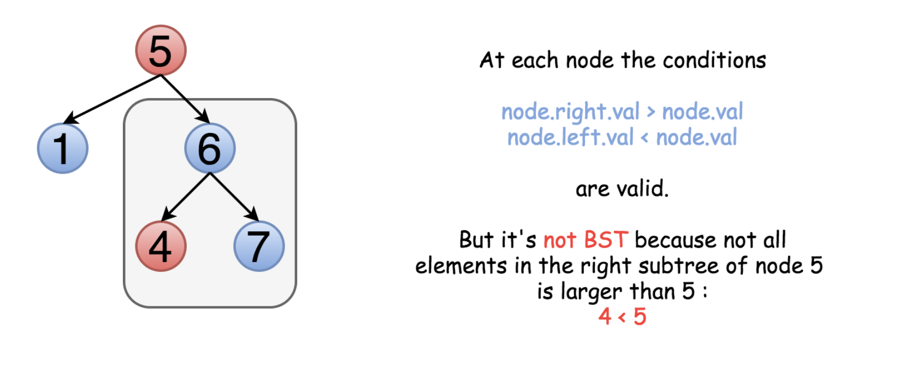
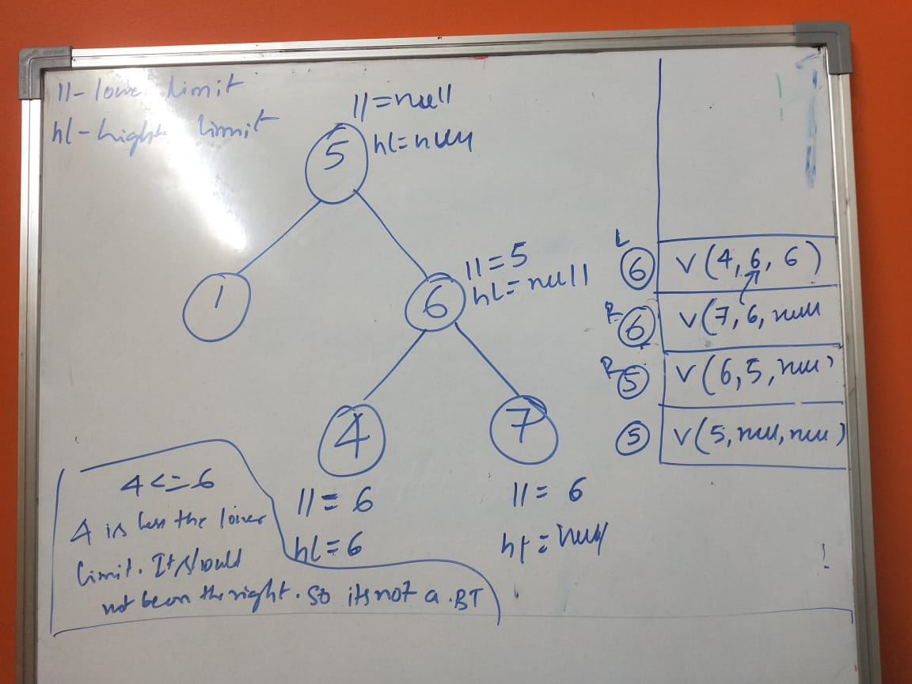

## Question
Given the root of a binary tree, determine if it is a valid binary search tree (BST).

A valid BST is defined as follows:

The left subtree of a node contains only nodes with keys less than the node's key.
The right subtree of a node contains only nodes with keys greater than the node's key.
Both the left and right subtrees must also be binary search trees.

Input: root = [2,1,3]
Output: true

//      5
//  1        4
//         3    6
Input: root = [5,1,4,null,null,3,6]
Output: false
Explanation: The root node's value is 5 but its right child's value is 4.

## Solution

[Leetcode](https://leetcode.com/problems/validate-binary-search-tree/solution/)